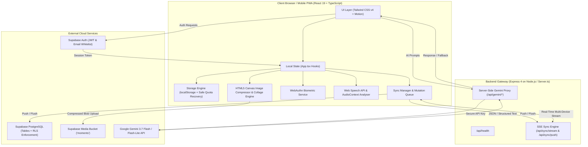
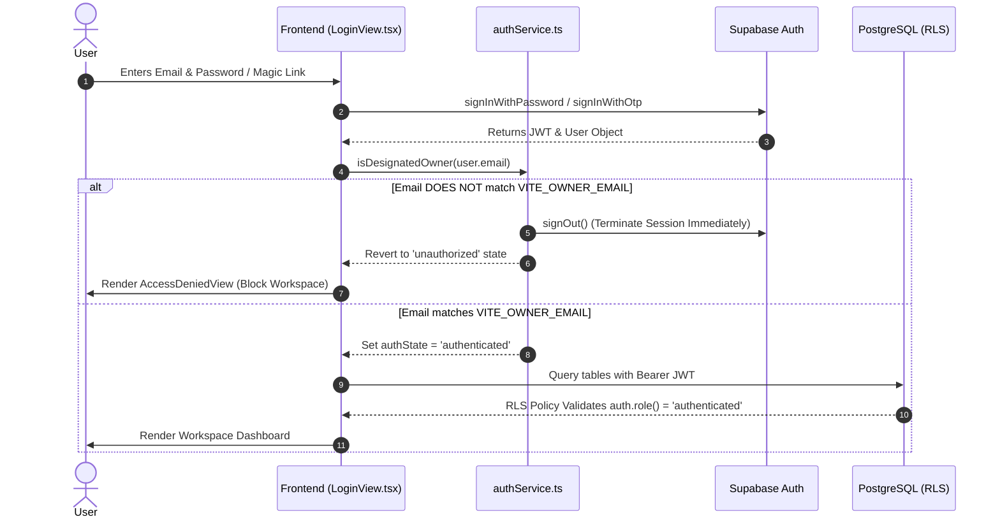
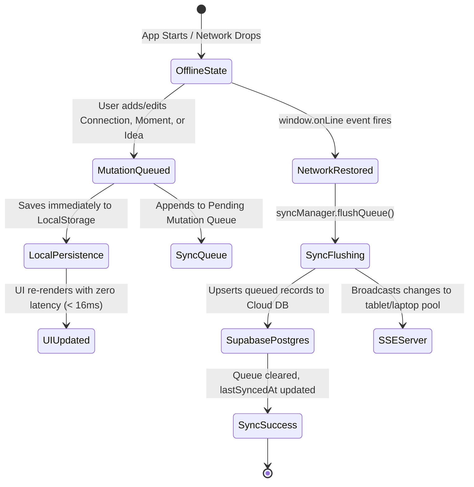

# 🚀 Momentum — Personal Event OS for TEDxAkure 2026

[](https://react.dev/)
[](https://www.typescriptlang.org/)
[](https://tailwindcss.com/)
[](https://supabase.com/)
[](https://ai.google.dev/)
[](https://tedxakure.com)

> **Momentum** is a private, single-owner **Personal Event Operating System** engineered for high-conviction networking, multimodal memory capture, contextual AI synthesis, and high-velocity relationship compounding at **TEDxAkure 2026**.

---

## 📑 Table of Contents

1. [Product Overview & Philosophy](#1-product-overview--philosophy)
2. [Feature Matrix & User Flows](#2-feature-matrix--user-flows)
3. [System Architecture & Data Flow](#3-system-architecture--data-flow)
4. [Tech Stack & Infrastructure](#4-tech-stack--infrastructure)
5. [Data, Security & Single-Owner Privacy](#5-data-security--single-owner-privacy)
6. [Offline-First Architecture & Event Resilience](#6-offline-first-architecture--event-resilience)
7. [AI Integration & Gemini Engine](#7-ai-integration--gemini-engine)
8. [UX/UI & Mobile-First Interaction Design](#8-uxui--mobile-first-interaction-design)
9. [Development, Build & Deployment Guide](#9-development-build--deployment-guide)
10. [Limitations & Engineering Roadmap](#10-limitations--engineering-roadmap)
11. [The Content Engine: 28 Ready-to-Publish Angles](#11-the-content-engine-28-ready-to-publish-angles)
12. [Repository Metrics & Facts](#12-repository-metrics--facts)
13. [Author & License](#13-author--license)

---

## 1. Product Overview & Philosophy

### 1.1 The Problem: Conference Networking Entropy
Conferences like **TEDxAkure 2026** assemble visionary founders, operators, civic leaders, and creators in a single venue. Yet, standard conference networking suffers from structural breakdown:

```
[ Serendipitous Meeting ]
          │
          ▼
[ Business Card / Scrappy Note ] ──► (Lost in pocket / notebook)
          │
          ▼
[ Congested Hallway Wi-Fi ]     ──► (Cloud CRM fails to load)
          │
          ▼
[ 72 Hours Later ]              ──► (Context erased, names forgotten, zero follow-up)
          │
          ▼
[ Result ]                      ──► ZERO ROI on conference time & energy
```

Traditional generic CRMs (HubSpot, Salesforce) are far too slow, heavy, and form-dense for high-pressure, 45-second hallway conversations. Generic note apps (Apple Notes, Notion) lack structured relationship pipelines, follow-up timers, and immediate multi-channel message dispatch.

### 1.2 The Vision: Momentum Event OS
Momentum transforms event attendance from passive listening into an **active compound engine**. It provides a single user with an ultra-responsive, mobile-first dashboard to systematically track **50 high-impact connections**, capture spoken ideas, archive moments with live photos/voice notes, and trigger personalized follow-ups across WhatsApp, LinkedIn, and Email within seconds.

### 1.3 Core Philosophy: The 5-Stage Compounding Loop

$$\textbf{MEET} \longrightarrow \textbf{CAPTURE} \longrightarrow \textbf{UNDERSTAND} \longrightarrow \textbf{FOLLOW UP} \longrightarrow \textbf{COMPOUND}$$

| Stage | Objective | Mechanism in Momentum |
| :--- | :--- | :--- |
| **1. MEET** | Break ice, establish presence, share identity | Quick QR Code badge display, 1-tap profile sharing, haptic feedback on target pacing. |
| **2. CAPTURE** | Record context in under 15 seconds | Camera modal with client-side canvas compression, Web Speech voice dictation, multi-photo attachments. |
| **3. UNDERSTAND** | Distill signal from noise | Gemini AI memory point synthesis, keynote quote attribution, priority categorization (`high`/`medium`/`low`). |
| **4. FOLLOW UP** | Eliminate latency between meeting & action | 1-tap WhatsApp/LinkedIn/Email generator, overdue/today/upcoming triage matrix. |
| **5. COMPOUND** | Convert single interactions into long-term equity | Executive PDF journal generation, media archive ZIP, shareable social recap, 5-level gamification engine. |

### 1.4 The TEDxAkure Context
TEDxAkure 2026 represents a landmark gathering in Ondo State's burgeoning tech and creative ecosystem. Momentum was specifically calibrated for this event environment:
- High ambient noise (compensated by visual audio meters & one-handed touch controls).
- Flaky auditorium cellular reception (compensated by local-first storage & background queue flushing).
- Rapid session transitions (compensated by quick-capture floating action triggers and keyboard-optimized inputs).

---

## 2. Feature Matrix & User Flows

Momentum categorizes all functionality into three clear operational states: **Implemented (Current)**, **Experimental**, and **Planned (Roadmap)**.

```
┌─────────────────────────────────────────────────────────────────────────────────────────┐
│                                   MOMENTUM OS CORE SUITE                                │
├──────────────────────────────┬─────────────────────────────┬────────────────────────────┤
│     CURRENT / IMPLEMENTED    │         EXPERIMENTAL        │      PLANNED / ROADMAP     │
├──────────────────────────────┼─────────────────────────────┼────────────────────────────┤
│ • Web-NFC "Phone Bump" &     │ • WebAuthn Face/Touch ID    │ • Client-Side OCR Engine   │
│   Contact Handshake Exchange │ • Web Speech Dictation      │ • Dynamic Agenda Scraping  │
│ • NFC Collision Detection &  │ • Battery API Power Saver   │ • WhatsApp Cloud API Hook  │
│   Smart Lead Merge UI        │ • Multi-Device SSE Stream   │ • Direct Bluetooth Mesh    │
│ • Global NFC Power Switch &  │ • Browser Notification API  │                            │
│   Battery Conservation Mode  │   Follow-Up Push Reminders  │                            │
│ • Chronological NFC History  │ • Live Audio Segmentation   │                            │
│   Timeline & Multi-Bump Log  │                             │                            │
│ • Filtered NFC-Captured CSV  │                             │                            │
│   Export with Metadata Tags  │                             │                            │
│ • Universal Event Hub &      │                             │                            │
│   Multi-Event Switcher       │                             │                            │
│ • AI Agenda Parser (1-Click) │                             │                            │
│ • Preset Catalog (Tech/TEDx/ │                             │                            │
│   Summit/Hackathon/Mastermind│                             │                            │
│ • Interactive 6-Step Tour &  │                             │                            │
│   Onboarding Guide Modal     │                             │                            │
│ • 4-Colorway Dynamic Theme   │                             │                            │
│   Engine (Cobalt/Emerald/Iris│                             │                            │
│ • 24-Hour Guest Sandbox Mode │                             │                            │
│   w/ Storage & Bandwidth Caps│                             │                            │
│ • UI/UX Pro Max Design Token │                             │                            │
│   Architecture & dvh Modals  │                             │                            │
│ • Constellation Force Radar  │                             │                            │
│   & AI Warm Intro Matchmaker │                             │                            │
│ • AI Pitch Arena & Coach     │                             │                            │
│ • 3D Holographic NFC Pass    │                             │                            │
│ • Live Copilot & Venue Kit   │                             │                            │
│ • Executive ROI Scorecard    │                             │                            │
│ • Kanban Pipeline & Batch AI │                             │                            │
│ • 50-Connection Ring Engine  │                             │                            │
│ • Smart People Directory     │                             │                            │
│ • Touch Swipe Gestures (L/R) │                             │                            │
│ • Multimodal Capture Hub     │                             │                            │
│ • Live Smart Notes & Dossiers│                             │                            │
│ • Voice Recorder + Analyser  │                             │                            │
│ • Keynotes & Ideas Vault     │                             │                            │
│ • Follow-Ups Action Matrix   │                             │                            │
│ • Gemini 3.7 AI Synthesis    │                             │                            │
│ • Offline-First Sync Queue   │                             │                            │
│ • Supabase RLS Persistence   │                             │                            │
│ • 4-Digit Privacy Shade      │                             │                            │
│ • Executive PDF & ZIP Export │                             │                            │
│ • 1:1 & 9:16 Collage Studio  │                             │                            │
│ • Contingency Snapshot Hub   │                             │                            │
│ • 5-Level Gamification & XP  │                             │                            │
└──────────────────────────────┴─────────────────────────────┴────────────────────────────┘
```

### 2.1 Implemented User Flows

#### Flow A: 15-Second Hallway Connection Capture & Web-NFC Phone Bump
1. Tap the floating **`+ Quick Connect`** action button on the mobile navbar or the pulsating **`NFC Bump`** trigger.
2. **Contactless Phone Bump (`Web-NFC NDEFReader`):** Bump device backs against another attendee's smartphone.
   - The app reads standard vCard 3.0 / JSON NDEF records from the peer device.
   - Triggers tactile haptic feedback via `navigator.vibrate([25, 45, 25, 80])` upon handshake confirmation.
   - Parses the contact payload and pre-fills the Name, Role, Organization, Phone, Email, and LinkedIn directly into the form.
   - Dispatches an immediate emerald toast notification (`Parsed NFC contact for [Name]!`).
3. **Collision Detection UI:** If an attendee with the same phone, email, or name already exists in your database:
   - Launches `NfcCollisionModal` displaying a side-by-side comparison of the existing contact vs incoming bump payload.
   - Provides 1-tap resolution options: **Update Existing Contact with New Data**, **Log Re-encounter Bump Event**, or **Save as Separate Record**.
4. **Battery-Saving Global Toggle:** Enable or disable the Web-NFC scanner anytime inside the Contingency & Health Hub to save battery during lengthy keynote sessions.
5. **Multi-Bump History Log:** In `ConnectionDetailModal`, view the chronological history of every physical NFC bump encounter with timestamps, venue context, and serial identifiers.
6. **Dedicated CSV Export:** In `ExportsView`, download a dedicated CSV containing all verified NFC-bumped connections clearly marked to distinguish from manual entries.

#### Flow B: Constellation Force Radar & AI Warm Matchmaking
1. Launch the **`Constellation Network`** radar visualizer from the Dashboard or More drawer.
2. Explore an interactive, force-directed graph rendering all event contacts grouped into gravitational clusters (`Leads`, `Speakers`, `Mentors`, `Peers`).
3. Switch to the **`AI Warm Matchmaker`** tab: Gemini automatically scans your network for complementary synergies (e.g. founder meeting investor, designer meeting engineer).
4. Review auto-generated double-opt-in warm introduction templates with 1-click dispatch to WhatsApp, Email, or LinkedIn.

#### Flow C: AI Pitch Arena & Elevator Sparring Simulator
1. Open the **`Pitch Arena`** before entering the keynote foyer or VIP lounge.
2. Select your practice audience persona: **Ruthless VC**, **Realistic Angel**, **Technical Lead**, **Enterprise Buyer**, or **Keynote Speaker**.
3. Rehearse via speech dictation or write your pitch, using the adjustable auto-scrolling teleprompter.
4. Receive instant multi-factor scoring (Hook, Clarity, Delivery, Filler words detected) with tailored rewrites and mock persona dialogue.

#### Flow D: 3D Holographic Pass & Virtual NFC Beam
1. Tap **`Digital Pass`** to open the interactive 3D delegate badge with real-time gyroscope/mouse tilt reflections and lanyard clip.
2. Share your dynamic QR code or trigger **`NFC Beam`** to share your vCard 3.0 profile without physical touch.

#### Flow E: Live Event Copilot & Venue Survival Kit
1. Access the **`Live Copilot`** HUD during the conference to view active session status, stage countdowns, and instant contextual icebreakers tailored to the speaker's topic.
2. Quick-copy the emergency venue Wi-Fi credentials, inspect verified quiet phone call zones, and locate charging stations.

#### Flow F: Contextual 1-Tap Follow-Up Dispatch & Batch Outreach
1. Open the **`Follow-Ups`** view to inspect overdue, today, and upcoming commitments across the 5-stage Kanban pipeline.
2. Tap **`Quick Message`** on any contact card for bespoke WhatsApp/LinkedIn/Email copy, or launch the **`Batch AI Outreach`** generator to process all pending contacts in seconds.
3. Tap **`Launch WhatsApp`** $\rightarrow$ Deep-links directly to `https://wa.me/<phone>?text=<encoded_msg>` with zero copy-paste friction.

#### Flow G: Executive ROI Scorecard & End-of-Day Compounding
1. Navigate to the **`Executive ROI`** scorecard to review networking velocity (contacts/hour), relationship equity grading, and key strategic wins.
2. Generate an editorial summary and ready-to-post LinkedIn recap.
3. Open the **`Collage Studio`** to generate high-resolution 1:1 or 9:16 branded image grids for Instagram Stories and Twitter/X.
4. Export the complete conference dossier as an **A4 PDF Executive Journal** or a structured **Media Archive ZIP**.

---

## 3. System Architecture & Data Flow

Momentum operates as a hybrid **Client-First Single Page Application (SPA) with a Server-Side AI & Multi-Device SSE Relay**.

### 3.1 Architectural Diagram



### 3.2 Key Directories & Code Structure

```
├── .env.example                 # Declared environment variables (no raw secrets)
├── metadata.json                # AI Studio manifest, frame permissions & capabilities
├── package.json                 # Project dependencies, build & start scripts
├── server.ts                    # Express backend: Gemini API gateway & SSE multi-device sync
├── netlify.toml                 # Netlify deployment configuration & SPA redirects
├── supabase/
│   └── schema.sql               # PostgreSQL schema & hardened single-owner RLS policies
├── src/
│   ├── main.tsx                 # React DOM root entry point
│   ├── App.tsx                  # Core state manager, tab router & root layout
│   ├── index.css                # Global CSS styling with @import "tailwindcss"
│   ├── types.ts                 # TypeScript interfaces, types & data models
│   ├── components/              # 29 modular, isolated presentation & modal components
│   │   ├── DashboardView.tsx    # 50-connection milestone ring & quick metrics
│   │   ├── PeopleView.tsx       # Searchable connection directory & filters
│   │   ├── CaptureHubView.tsx   # Multimodal camera, voice, and note capture hub
│   │   ├── MomentsView.tsx      # Chronological photo/media timeline
│   │   ├── IdeasView.tsx        # Keynote & quote repository
│   │   ├── FollowUpsView.tsx    # Status-based follow-up triage pipeline
│   │   ├── RecapView.tsx        # AI conference recap & LinkedIn generator
│   │   ├── ExportsView.tsx      # PDF, ZIP, CSV, JSON export center
│   │   ├── LoginView.tsx        # Supabase authentication interface
│   │   ├── AccessDeniedView.tsx # Unauthorized email lockdown screen
│   │   ├── SecurityLockModal.tsx# PIN & Biometric privacy shade controls
│   │   ├── LockScreenOverlay.tsx# Rapid unlock modal
│   │   ├── ContingencyHubModal.tsx# Power saver, storage metrics & snapshot recovery
│   │   ├── CollageGeneratorModal.tsx# 1080x1080 canvas collage builder
│   │   ├── QuickConnectModal.tsx# Rapid 15-second contact onboarding
│   │   ├── QuickMessageModal.tsx# AI WhatsApp/LinkedIn/Email composer
│   │   ├── VoiceMemoModal.tsx   # Web Audio visualizer & voice memo recorder
│   │   └── ...
│   ├── services/                # 13 pure TypeScript domain service modules
│   │   ├── aiService.ts         # Client wrapper for server-side Gemini endpoints
│   │   ├── authService.ts       # Supabase Auth, single-owner gatekeeping & PIN hashing
│   │   ├── biometricService.ts  # WebAuthn platform authenticator registration & verify
│   │   ├── contingencyService.ts# 5-slot snapshot manager & quota diagnostics
│   │   ├── exportService.ts     # jsPDF, JSZip, and CSV formatting engines
│   │   ├── gamification.ts      # XP, leveling (1-5), and badge calculation
│   │   ├── haptics.ts           # Navigator.vibrate tactile feedback service
│   │   ├── imageCompression.ts  # Canvas 2D image downsampling & blob pipeline
│   │   ├── multiDeviceSync.ts   # SSE multi-device synchronization engine
│   │   ├── speechService.ts     # Web Speech API & MediaRecorder controllers
│   │   ├── storage.ts           # Local persistence & safe JSON serialization
│   │   ├── supabaseClient.ts    # Lazy Supabase client initialiser
│   │   ├── supabaseSync.ts      # Bi-directional Supabase PostgreSQL synchroniser
│   │   └── syncManager.ts       # Offline mutation queue with exponential backoff
│   └── hooks/
│       └── useBatteryStatus.ts  # Battery API status, level & power state hook
```

---

## 4. Tech Stack & Infrastructure

Every dependency in Momentum was chosen for performance, zero runtime overhead, and strict offline compatibility:

| Technology | Version | Purpose in Momentum | Why Chosen |
| :--- | :--- | :--- | :--- |
| **React** | `19.0.1` | Core UI library | Concurrent rendering, modern hooks, zero unnecessary re-renders. |
| **TypeScript** | `5.8.2` | Language & type safety | 100% strict type safety across entities, storage, and API contracts. |
| **Tailwind CSS** | `v4.1.14` | Styling framework | Zero-runtime CSS engine, sub-millisecond utility compiles. |
| **Motion** | `12.23.24` | Transitions & layout animations | Fluid tab switches, progress ring transitions, and modal physics. |
| **Express** | `4.21.2` | Backend API gateway | Securely proxies Gemini API requests, serves SSE streams & SPA assets. |
| **@google/genai** | `2.4.0` | Official Gemini SDK | High-performance server-side integration with Gemini 3.7 Flash. |
| **@supabase/supabase-js**| `2.112.3`| Database & Auth SDK | Real-time PostgreSQL client, token management, and cloud storage. |
| **jsPDF** | `4.2.1` | Document generation | Native client-side PDF rendering for executive conference dossiers. |
| **JSZip** | `3.10.1` | Archive bundling | Generates complete `.zip` archives containing JSON, photos, and Markdown. |
| **QRCode** | `1.5.4` | Profile sharing | Generates client-side QR codes for instant contact exchange without internet. |
| **Canvas-Confetti** | `1.9.4` | Milestone celebration | High-performance particle bursts upon hitting the 50-connection goal. |
| **Lucide React** | `0.546.0` | Iconography | Crisp, lightweight, uniform icon set across all views. |
| **Date-fns** | `4.4.0` | Date formatting | Lightweight date math for follow-up schedules. |
| **Vite** | `6.2.3` | Frontend bundler | Ultra-fast HMR-free production compilation and asset optimization. |
| **esbuild** | `0.25.0` | Backend compilation | Bundles `server.ts` into a self-contained CommonJS artifact (`dist/server.cjs`). |

---

## 5. Data, Security & Single-Owner Privacy

Momentum is architected as a **private, single-owner system**. It is strictly intended for the authorized owner (`faithakinboyejo@gmail.com`) and enforces zero-trust boundaries at both client and database levels.

### 5.1 Authentication Architecture



### 5.2 Multi-Tier Security Controls

1. **Environment Gatekeeping (`VITE_OWNER_EMAIL`)**:
   - The application checks the logged-in email against `VITE_OWNER_EMAIL`.
   - **Production Fail-Closed**: In production builds, if `VITE_OWNER_EMAIL` is omitted, the app refuses all logins and logs a security alert rather than falling back to an unverified default.
2. **PostgreSQL Row Level Security (RLS)**:
   - All private tables (`connections`, `moments`, `ideas`, `event_sessions`, `profiles`) have RLS strictly enabled.
   - All legacy `USING (true)` public policies are removed.
   - Only requests with valid authenticated JWT tokens (`auth.role() = 'authenticated'`) are permitted to read or mutate records.
3. **Client Privacy Shade & Biometric Lock**:
   - **4-Digit PIN Lock**: Uses SHA-256 cryptographic hashing to store pin verification in local storage.
   - **WebAuthn Platform Biometrics**: Registers Face ID, Touch ID, Windows Hello, or Android Fingerprint via `navigator.credentials.create()` with user verification required.
   - **Privacy Shade**: When stepping away from a phone or handing it to another attendee to show the QR code, the owner can trigger the Privacy Shade to blur all notes and contacts.
4. **Hardware Resource Hygiene**:
   - Microphone and camera streams explicitly invoke `.stop()` on every `MediaStreamTrack` immediately when recording ceases or modals close, turning off device recording indicators instantly.
5. **Secret Isolation**:
   - The `GEMINI_API_KEY` is strictly confined to server-side code (`server.ts`) and is never prefixed with `VITE_` or bundled in client assets.
   - The Supabase client uses only the public `anon` key; no administrative `service_role` key exists in the frontend codebase.

### 5.3 Honest Security Limitations
- **Supabase Project Auth Model**: While RLS restricts queries to authenticated users, if public signups remain open in the Supabase Dashboard, any registered account could theoretically query the database. **Requirement**: The owner must disable new user registrations in the Supabase Dashboard under *Authentication $\rightarrow$ Providers $\rightarrow$ Email* after initial setup.
- **Client-Side PIN Storage**: The 4-digit PIN is stored as a SHA-256 hash in `localStorage`. This protects against casual over-the-shoulder glance attacks in conference hallways, not a forensic inspection of device hardware.

---

## 6. Offline-First Architecture & Event Resilience

Conference halls frequently suffer from congested cellular towers and captive Wi-Fi portals. Momentum guarantees that **100% of core actions (capturing contacts, snapping photos, recording notes, viewing follow-ups) work completely offline**.

### 6.1 Synchronization Architecture



### 6.2 The Storage & Contingency Engine

1. **Safe Storage Wrapper (`safeStorageSet`)**:
   - Intercepts browser `QuotaExceededError` exceptions.
   - Automatically prunes transient cache keys (`temp_*`, `cache_*`) to ensure critical attendee records are never lost.
2. **5-Slot Rollback Snapshot Manager (`contingencyService.ts`)**:
   - Takes rolling automatic and manual JSON snapshots of all application state.
   - Allows instant 1-tap data restoration if an accidental deletion occurs.
3. **Ultra Power Saver Mode**:
   - Listens to the Web Battery API (`navigator.getBattery()`).
   - When battery drops below 20% or when manually toggled, the UI suspends background animation loops, pauses non-critical SSE streams, disables confetti particles, and renders in true high-contrast OLED black to conserve battery.
4. **Demo Data Isolation & Trash Recovery**:
   - Initial sample records are tagged with `isDemo: true`.
   - The owner can send all demo data to the Trash Bin with a single click before the conference begins, with full recovery support if needed.

---

## 7. AI Integration & Gemini Engine

Momentum integrates Google's **Gemini 3.7 Flash** model to provide real-time intelligence without introducing latency into the user experience.

### 7.1 Implemented AI Capabilities

| Feature | Endpoint | Input Context | Model Output | Fallback Behavior |
| :--- | :--- | :--- | :--- | :--- |
| **Quick Follow-Up Generator** | `POST /api/gemini/quick-message` | Name, Company, Profession, Relationship, Notes, Talk Context, Channel (`whatsapp`/`linkedin`/`email`) | Crisp, personalized, channel-optimized outreach message. | Structured offline template customized with contact name & notes. |
| **Conversation Memory Extractor** | `POST /api/gemini/summarize-connection` | Contact Name, Company, Raw notes, Quotes | JSON object with 3 high-impact memory points, suggested tags, and priority tier. | Client-side heuristic parser extracting tags and structured bullets. |
| **Daily Conference Synthesis** | `POST /api/gemini/recap` | Total connection count, moments count, ideas count, array of contact names, top quotes | Editorial impact synthesis, 3 macro theme tags, and a publish-ready LinkedIn post. | Pre-rendered conference impact summary with dynamic milestone stats. |

### 7.2 Multi-Model Resilience Strategy
In `server.ts`, the backend implements an automatic model cascade with retry logic:
1. Primary: `gemini-3.7-flash` (fastest response time, state-of-the-art reasoning)
2. Secondary: `gemini-flash-latest` (high-availability fallback)
3. Tertiary: `gemini-3.1-flash-lite` (ultra-compact latency model)
4. Offline: Pure client-side regex and template generation if no network connection exists.

---

## 8. UX/UI & Mobile-First Interaction Design

Momentum rejects generic dashboard templates and visual clutter in favor of an **editorial OLED canvas** optimized for one-handed smartphone operation.

```
┌────────────────────────────────────────────────────────┐
│  MOMENTUM OS — PALETTE & ERGONOMIC SPECIFICATION       │
├────────────────────────────────────────────────────────┤
│  Canvas Background:   #0A0A0A (Pure Deep Obsidian)     │
│  Surface Card:        #140A06 (Warm Charcoal Brown)    │
│  Primary Accent:      #FF5C00 (Electric Tangerine)     │
│  Secondary Accent:    #FF8A3D (Coral Glow)             │
│  Success State:       #10B981 (Emerald Green)          │
│  Text Primary:        #FFFFFF (High-Contrast White)    │
│  Text Secondary:      #A89A92 (Muted Warm Stone)       │
├────────────────────────────────────────────────────────┤
│  Touch Targets:       Min 44px x 44px (Thumb-zone)     │
│  Haptic Engine:       8 distinct vibration patterns    │
│  Typography:          Modern Sans-Serif + Monospace    │
└────────────────────────────────────────────────────────┘
```

### 8.1 Ergonomic Decisions
- **Bottom Navigation Hub**: Primary navigation tabs (`Home`, `People`, `Capture`, `Moments`, `Ideas`, `Follow-ups`, `More`) are pinned within easy reach of the user's thumb.
- **Floating Action Button (FAB)**: The central **`+ Quick Connect`** trigger is elevated and accessible from any screen.
- **Multi-Sensory Feedback (Haptics)**:
  - `light` (12ms): Tab transitions and filter chips.
  - `success` ([18ms, 40ms, 25ms]): Record saved or synchronized.
  - `milestone` ([40ms, 50ms, 60ms, 50ms, 100ms]): Reaching the 50-connection goal.
  - `delete` ([40ms, 50ms, 45ms]): Moving items to the trash bin.

---

## 9. Development, Build & Deployment Guide

### 9.1 Prerequisites
- **Node.js**: `v20.x` or `v22.x`
- **npm**: `v10.x` or higher
- **Supabase Project**: (Optional for local-only testing, required for cloud sync)
- **Google Gemini API Key**: (Optional for template fallback, required for live AI generation)

### 9.2 Local Development Setup

1. **Clone the repository**:
   ```bash
   git clone https://github.com/your-username/momentum-tedxakure-2026.git
   cd momentum-tedxakure-2026
   ```

2. **Install dependencies**:
   ```bash
   npm install
   ```

3. **Configure Environment Variables**:
   Create a `.env` file from `.env.example`:
   ```bash
   cp .env.example .env
   ```

   Configure the required variables:
   ```env
   # Server-Side Gemini API Key (keep secret, never prefix with VITE_)
   GEMINI_API_KEY="your-gemini-api-key"

   # Supabase Configuration
   VITE_SUPABASE_URL="https://your-project.supabase.co"
   VITE_SUPABASE_ANON_KEY="your-supabase-anon-key"

   # Single-Owner Gatekeeper
   VITE_OWNER_EMAIL="faithakinboyejo@gmail.com"
   ```

4. **Start the Development Server**:
   ```bash
   npm run dev
   ```
   The application will be accessible at **`http://localhost:3000`**.

5. **Run Type-Checking / Lint**:
   ```bash
   npm run lint
   ```

### 9.3 Production Build

The production build compiles the client-side SPA with Vite and bundles the Express backend server with `esbuild`:

```bash
npm run build
```

This generates:
- `dist/`: Optimized client assets (`index.html`, JavaScript bundles, CSS).
- `dist/server.cjs`: Self-contained, bundled Node.js backend server.

To test the production build locally:
```bash
npm run start
```

### 9.4 Netlify Deployment Setup

Momentum is pre-configured for seamless deployment to Netlify via `netlify.toml`:

```toml
[build]
  command = "npm run build:client"
  publish = "dist"

[[redirects]]
  from = "/*"
  to = "/index.html"
  status = 200
```

#### Steps to Deploy to Netlify:
1. Push your repository to GitHub / GitLab.
2. In the Netlify Dashboard, create a **New site from Git**.
3. Set **Build command**: `npm run build:client`
4. Set **Publish directory**: `dist`
5. Under **Site Configuration $\rightarrow$ Environment Variables**, define:
   - `VITE_SUPABASE_URL`
   - `VITE_SUPABASE_ANON_KEY`
   - `VITE_OWNER_EMAIL`
6. In your Supabase Dashboard under *Authentication $\rightarrow$ URL Configuration*, add your Netlify domain (e.g. `https://angelomomentum.netlify.app/**`) to the **Redirect URLs**.

---

## 10. Limitations & Engineering Roadmap

### 10.1 Honest Technical Limitations
- **Single-User Scope**: Momentum is deliberately engineered as a single-owner OS. It does not support multi-tenant team workspaces or public multi-user logins.
- **Local Storage Quota for Videos**: High-resolution video recordings cannot be stored indefinitely in browser `localStorage`. Video captures are optimized for quick clips or uploaded to Supabase Storage when online.
- **Web Speech API Browser Variance**: Continuous speech dictation depends on browser support (`webkitSpeechRecognition`). In unsupported browsers (e.g. certain Safari versions), a graceful text-input fallback is provided.

### 10.2 Roadmap & Future Milestones

- [x] **Web-NFC "Phone Bump" Hardware Protocol**: Touchless physical contact exchange via device Near Field Communication.
- [x] **Constellation Force Radar & AI Matchmaker**: Graph visualizer for discovering network synergies and drafting warm intros.
- [x] **AI Pitch Arena & Sparring Simulator**: Real-time teleprompter, speech evaluation, and 5 distinct stakeholder personas.
- [x] **Multi-Event Switcher & Preset Catalog**: Rapid 1-click onboarding for any tech conference, summit, or hackathon.
- [x] **UI/UX Pro Max Design Token Refactor**: Dynamic viewport units (`dvh`), semantic theme variables, and tactile micro-interactions.
- [ ] **Client-Side OCR for Physical Business Cards**: Integrate lightweight WebAssembly Tesseract.js for offline card scanning.
- [ ] **PWA Background Sync API**: Enable background service worker queue flushing when the browser tab is closed.
- [ ] **WhatsApp Cloud API Webhook Integration**: Direct automated delivery of scheduled follow-ups without opening native apps.

---

## 11. The Content Engine: 28 Ready-to-Publish Angles

Momentum was built with a build-in-public mindset. Here are **28 concrete content angles** across 6 formats derived directly from this codebase:

### 💼 LinkedIn Posts
1. **The 50-Connection Milestone**: Why setting an explicit numeric target transforms conference ROI from 0 to 10x.
2. **Why Most CRMs Fail at Conferences**: The case for 15-second mobile event tools vs heavyweight SaaS.
3. **The 48-Hour Follow-Up Rule**: How automated contextual drafting eliminates relationship drop-off.
4. **Building for TEDxAkure 2026**: How regional African tech conferences are inspiring bespoke personal tooling.
5. **Fail-Closed Security in Single-User Apps**: Why single-owner applications require stricter guardrails than multi-tenant software.

### 🧵 Twitter / X Threads
6. **"I built my own Event OS for TEDxAkure. Here’s the architecture:"** (Screenshots of 50-ring, capture hub, AI generator).
7. **"How to make Web Speech API and MediaRecorder work reliably in a crowded conference hall."**
8. **"Why we downsample photos from 8MB to 150KB in the browser before doing anything else."**
9. **"Building an offline-first queue in TypeScript with zero third-party state libraries."**
10. **"The OLED Obsidian & Tangerine design system: How to design for 8 hours of outdoor sunlight usage."**

### 🛠️ Technical Deep-Dives
11. **Browser-Based Image Downsampling**: Using Offscreen Canvas 2D smoothing to prevent memory leaks on mobile devices.
12. **Multi-Model LLM Resilience**: Implementing automated model fallbacks from Gemini 3.7 Flash to Flash-Lite.
13. **WebAuthn Biometric Implementation**: How to register Touch ID / Face ID platform authenticators in React 19.
14. **PDF Generation on the Edge**: Generating multi-page A4 executive dossiers entirely in client-side JavaScript using jsPDF.
15. **Supabase RLS Hardening**: Eliminating `USING (true)` policies for private personal applications.

### 🎨 Product & UX Lessons
16. **The Power of Haptic Micro-Interactions**: How 12ms tactile vibrations make web apps feel like native Swift code.
17. **Designing for Hallway Velocity**: Why every input form must submit in under 3 taps.
18. **The Privacy Shade Pattern**: How to let people see your QR badge without exposing your private notes.
19. **Gamifying Real-World Social Goals**: Designing XP algorithms and unlockable badges that motivate authentic networking.
20. **Visual Audio Analysers**: Implementing real-time frequency bin analysers with HTML5 AudioContext.

### 🔒 Security & Offline Architecture Lessons
21. **Zero-Trust Client Authentication**: Why checking `auth.user.email` on the frontend is never enough.
22. **Surviving QuotaExceededError**: Building safe `localStorage` recovery wrappers with automatic cache eviction.
23. **SSE vs WebSockets for Multi-Device Personal Sync**: Why Server-Sent Events are simpler and lighter for personal data relays.
24. **Battery API-Driven UI Throttling**: Automatically disabling particle physics and background sync below 20% battery.

### 🚀 Founder & Build-in-Public Stories
25. **"Why I spent 2 weeks building software just to attend one conference."**
26. **"The Anatomy of a Compounding Network": How one conversation at TEDxAkure can create a 5-year trajectory.**
27. **"From Hallway Chaos to Structured Knowledge": How Momentum captures keynote wisdom.**
28. **"The Anti-Slop UI Manifesto": Why we banned purple gradients and generic SaaS clichés from our interface.**

---

## 12. Repository Metrics & Facts

*All metrics derived directly from the current codebase:*

- **Core React Components**: 48 modular views, cards, and modals (`src/components/`).
- **Domain Services**: 19 TypeScript service modules (`src/services/`).
- **Data Models**: 100% strictly typed TypeScript interfaces (`src/types.ts`).
- **Target Connections Goal**: 50 verified attendees (`DashboardView.tsx`).
- **Export Formats Supported**: 5 distinct formats (A4 PDF, ZIP Media Archive, CSV Spreadsheet, CRM JSON, 1:1 Canvas Collage).
- **Gamification Depth**: 5 progression levels, 7 unlockable badges, and 4 XP award categories (`src/services/gamification.ts`).
- **Supported Channels**: 3 instant outreach integrations (WhatsApp deep-links, LinkedIn messaging, Email).
- **Security Tiers**: 3 independent layers (Supabase JWT Auth + Email Whitelist, WebAuthn Biometrics, 4-digit SHA-256 PIN).
- **Theme Palettes**: 4 refined modern colorways (Cyber Cobalt, Nordic Emerald, Royal Iris, Sunset Ember).
- **Guest Sandbox Mode**: 24-hour trial with 12MB storage quota, 30MB bandwidth transfer limiter, and safe entity guardrails.
- **Interactive Onboarding**: 6-step guided walkthrough covering compounding loop, multimodal ingestion, and NFC protocols.

---

## 13. Author & License

### Author
**Faith Akinboyejo**  
- Email: [faithakinboyejo@gmail.com](mailto:faithakinboyejo@gmail.com)  
- Conference: TEDxAkure 2026  

### License
This project is proprietary and personal software built for TEDxAkure 2026. All rights reserved.
